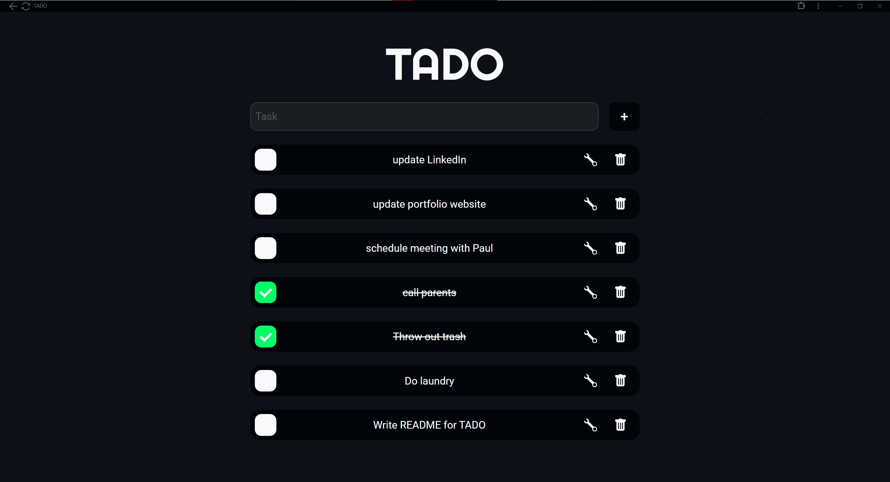
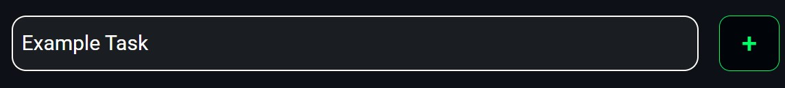
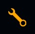
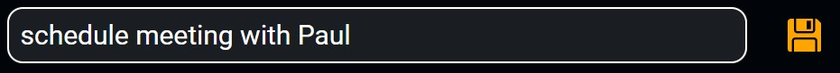
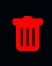

#  TADO

   

> [!NOTE]
> TADO is not setup to work if you clone the repo and want to run it locally.
> If you would like to test it out for yourself please get in [contact](#📧-contact) with me and I can help set it up.

 Table of Contents 

- [ TADO](#-tado)
  - [Demo Video](#demo-video)
  - [Description](#description)
  - [Motivations](#motivations)
  - [🚀 Quick Start](#-quick-start)
    - [Open up tado website in browser (if it was live)\\](#open-up-tado-website-in-browser-if-it-was-live)
    - [Add a Task](#add-a-task)
    - [Check](#check)
  - [⚙️ Usage](#️-usage)
    - [Edit](#edit)
    - [Delete](#delete)
  - [📧 Contact](#-contact)

## [Demo Video](https://youtu.be/nGsOr3CEeaM)

## Description

TADO is a react-based webapp that is a to-do list that can be checked off, edited and deleted. It is made using the FERN stack

## Motivations

I wanted to create a full stack webapp and also learn react and thought making a to-do app would be a good project to be able to put it all together.

## 🚀 Quick Start

> [!NOTE]
> TADO is not currently a live webapp
> Some instruction may not apply directly

### Open up tado website in browser (if it was live)\

### Add a Task

Enter in the task into the task input field.
Then click the plus next to it.

### Check

Click the checkbox to check off the task or uncheck it
 

## ⚙️ Usage

Reference above to see how to add a task and check it.

### Edit

You can edit the task info by clicking on the gear icon next to the task.

You can then edit and when you want to save it click the save icon.

### Delete

Click on the trashcan icon to delete a task.

## 📧 Contact

If you want any help or more info contact me at
dev.domgiarrusso@gmail.com
